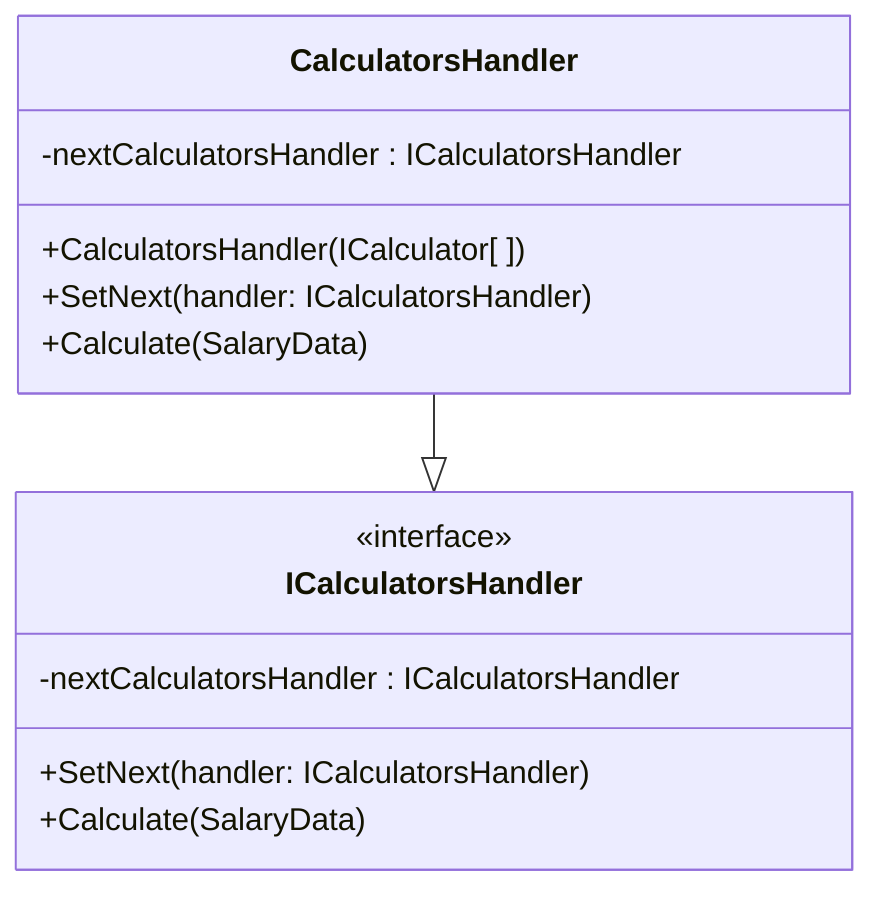
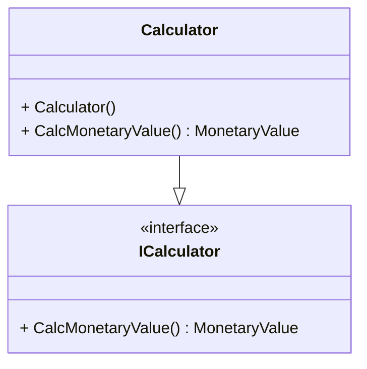

# UKTakeHomeCalc

## Content:
1. Introduction
2. Getting Started
3. Usage
4. Best Practices
5. Extending the Library
6. Support
7. License

## **Introduction:**

UKTakeHomeCalc is a C# library designed to simplify the task of calculating take home salary amounts for employees in the UK. This library is built with the latest rules in mind, ensuring accurate calculations every time. With just a few lines of code, this library can calculate gross pay, various types of deductions, and take-home pay. Designed to be easy to integrate, customize and extend, this library can help with take-home pay calculations.

The library relies on two classes to perform the calculations:
1. **ICalculatorsHandler**: donates a single stage of calculation and holds one or more '**ICalculator**' objects that get executed simultaneously. 
1. **ICalculator**: donates a single calculation process, for example tax, pension or student loan calculation.

### 1. **'CalculatorsHandler' Class:**

The take-home salary calculation process consists of different calculations that needs to be carried out in certain order as some calculations depend on values from other calculations. For example:
* Gross Salary is needed to calculate tax.
* Pension is untaxed deduction, so must be calculated before calculating tax.
* Student loans are taxed deductions, meaning that they are calculated after tax and national insurance calculations.

To achieve this, the '**CalculatorsHandler**' class is implemented using the '**Chain of Responsibility**' design pattern. Each calculation level is represented with one '**CalculatorsHandler**' object that contains a set of calculations to be carried out simultaneously, and these objects are connected together in the required order of execution with each one keeps a reference to its next '**CalculatorHandle**' object.

Each handler stores its result in the '**SalaryData**' and passes it to the next handler.

### 2. **'ICalculator' Class:**
 This class donates a single calculation process, for example tax, pension or student loan calculation. Each '**CalculatorsHandler**' object takes a set of calculators which will be carries out simultaneously. For example, tax and national insurance calculations are carried out using that same salary value, meaning that one cannot be carried out before the other. The calculators are represented using the '**ICalculator**' interface.

## **Usage:**

## **Extending the Library:**

## **Support:**

## **Licence:**

.

.

.

## **Gross Income Calculator**

### It calculates the total gross income

- Income Frequency

	- Daily
	- Weekly
	- Monthly
	- Annually

- Parameters

	- Basic Income
	- Hourly Rate
	- Overtime
	- Bonus
	- Extra Income

## Untaxable Deductions Calculator

### Calculates untaxable deductions value from gross income

- Parameters

	- Pension

## **Tax Due Calculator**

### Calculates tax due from gross income

- Calc strategies 

	- England
	- Scotland
	- Wales
	- N Ireland

- Personal allowance

	- Basic personal allowance
	- Married personal allowance
	- Blind personal allowance

## **National Insurance Calculator **

### Calculates NI contributions

- Personal allowance category letter

	- A
	- B
	- C
	- F
	- H
	- ...

- Calc stretagies

	- England
	- Scotland
	- Wales
	- N Ireland

## **Take-Home Income Calculator**

### Calculates Take-home income from gross income, Tax and NI

- Gross Income
- Untaxed Deduction
- Tax
- NI
- Tax-free Deductions

	- Student Loans

- Take-Home income

## **Gross Income**

6584

## *Tax Due*

## *NI Contributions*

