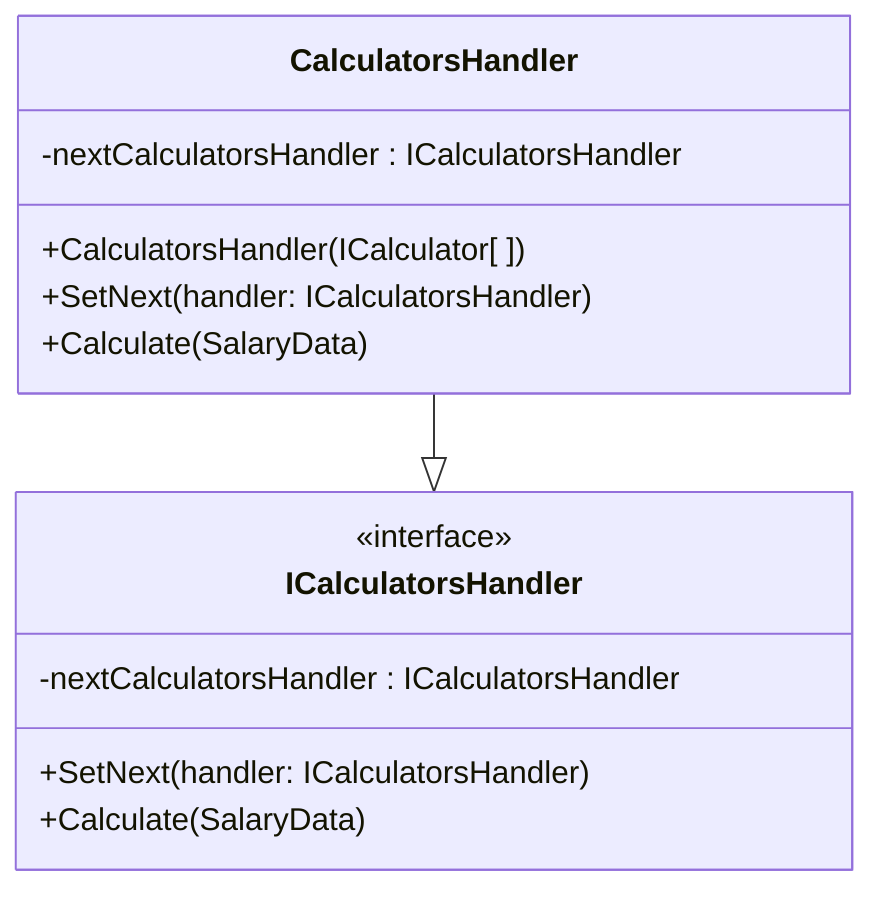
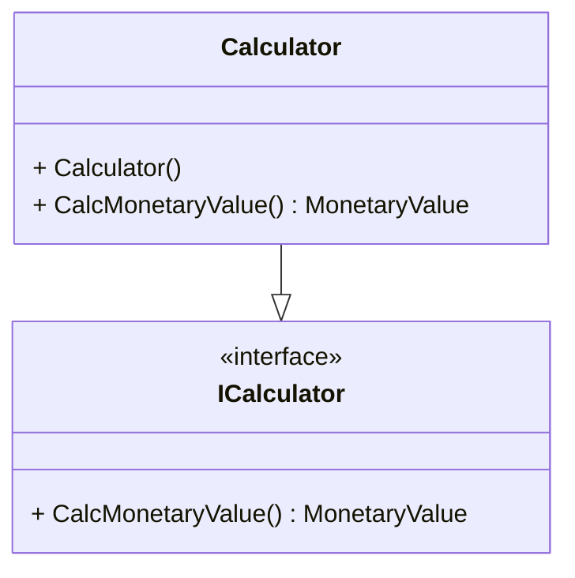

# "UKTakeHomeCalc" Main Components

```
This document summerizes the main components and classes of the project
```

## 'CalculatorsHandler' Class:

The take-home salary calculation process consists of different calculations that needs to be carried out in certain order as some calculations depend on values from other calculations. For example:
* Gross Salary is needed to calculate tax.
* Pension is untaxed deduction, so must be calculated before calculating tax.
* Student loans are taxed deductions, meaning that they are calculated after tax and national insurance calculations.

To achieve this, the '**CalculatorsHandler**' class is implemented using the '**Chain of Responsibility**' design pattern. Each calculation level is represented with one '**CalculatorsHandler**' object that contains a set of calculations to be carried out simultaneously, and these objects are connected together in the required order of execution with each one keeps a reference to its next '**CalculatorHandle**' object.

Each handler stores its result in the '**SalaryData**' and passes it to the next handler.


## 'ICalculator' Class:
Each '**CalculatorsHandler**' object takes a set of calculators which will be carries out simultaneously. For example, tax and national insurance calculations are carried out using that same salary value, meaning that one cannot be carried out before the other. The calculators are represented using the '**ICalculator**' interface.


