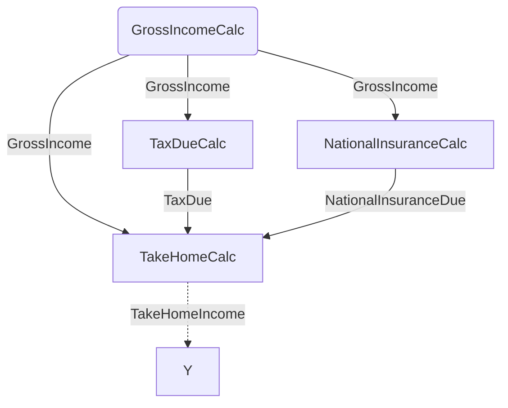
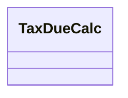
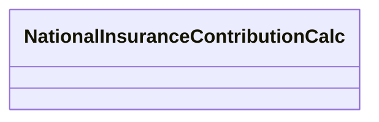

# "UKTakeHomeCalc" Flowchart

```mermaid
graph TD
    id1(GrossIncomeCalc) --GrossIncome--> TaxDueCalc
    id1(GrossIncomeCalc) --GrossIncome--> NationalInsuranceCalc
    id1(GrossIncomeCalc) --GrossIncome--> TakeHomeCalc
    TaxDueCalc --TaxDue--> TakeHomeCalc
    NationalInsuranceCalc --NationalInsuranceDue--> TakeHomeCalc -.TakeHomeIncome.-> Y
```

# "UKTakeHomeCalc" Classes Diagram

```mermaid
    classDiagram
        class GrossIncomeCalc
```

```mermaid
    classDiagram
        class TaxDueCalc
```

```mermaid
    classDiagram
        class NationalInsuranceContributionCalc
```

```mermaid
    classDiagram
        class TakeHomeCalc
```