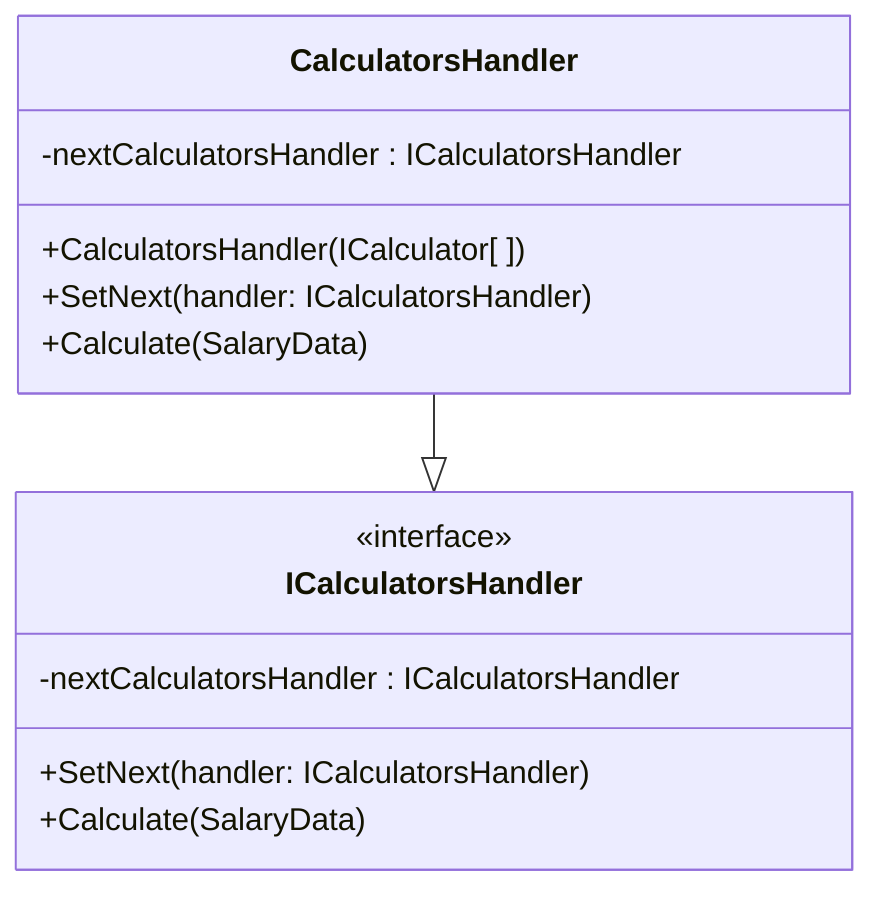
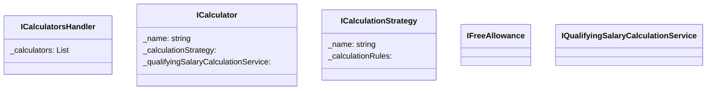

```mermaid
classDiagram
    class ICalculatorsHandler{
        <<interface>>
        -nextCalculatorsHandler : ICalculatorsHandler
        +SetNext(handler: ICalculatorsHandler)
        +Calculate(SalaryData)
    }

    CalculatorsHandler --|> ICalculatorsHandler
    class CalculatorsHandler{
        -nextCalculatorsHandler : ICalculatorsHandler
        +CalculatorsHandler(ICalculator[ ])
        +SetNext(handler: ICalculatorsHandler)
        +Calculate(SalaryData)
    }
```

```mermaid
classDiagram
    class ICalculatorsHandler{
        _calculators: List
    }

    class ICalculator{
        _name: string
        _calculationStrategy:
        _qualifyingSalaryCalculationService:
    }

    class ICalculationStrategy{
        _name: string
        _calculationRules:
    }


    class IFreeAllowance{

    }

    class IQualifyingSalaryCalculationService{

    }


```